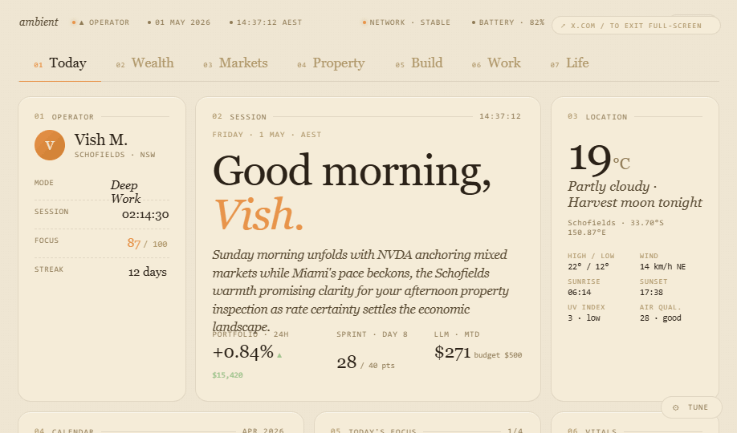

# Personal Dashboard

A single-page ambient dashboard — a personal homepage that surfaces what matters across seven domains: Today, Wealth, Markets, Property, Build, Work, and Life.

Built as one self-contained HTML file. No build step. No dependencies beyond the browser.



## Tabs

| Tab | What it answers |
|---|---|
| **Today** | What is the shape of today? Greeting, weather, focus, calendar, inbox, now-building, markets glance. |
| **Wealth** | Am I on track to $5M? Net worth, allocation, compound trajectory, savings rate, EOFY runway. |
| **Markets** | What moved in my book today? Holdings, watchlist, earnings, macro, AI-generated daily narrative. |
| **Property** | How is the Schofields position doing? Valuation, mortgage, yield, deal spotter, neighbourhood comps. |
| **Build** | What am I shipping? Active project, recent commits, agent runs, model usage. |
| **Work** | Where is the sprint? ServiceNow tickets, change windows, on-call, team workload. |
| **Life** | The slower axis. Reflection, reading, family, anniversaries, gratitude. |

## Design language

- **Warm earth palette** — bone backgrounds, terracotta and amber accents, espresso text. No neon.
- **Type system** — Crimson Pro (serif) for headlines, Inter for body, JetBrains Mono for labels and figures.
- **Bento layout** — every tab is a 12-column grid of cards. Each card has a numbered label and a single clear job.
- **Two themes** — light (default, warm cream) and dark (deep espresso). Toggle in the Tweaks panel.
- **Three accents** — terracotta, amber, moss. Picks the highlight colour across the whole dashboard.

## Live cells

Three cards regenerate text once per day via Claude:

- Today's greeting subtitle
- Markets · "What changed for me today"
- Life · Morning Reflection

Hover any card to reveal a `↻` regenerate button. Cached per day in `localStorage`.

> **Note:** the live cells depend on a `window.claude.complete` helper that exists only inside the original authoring environment. When opened anywhere else (GitHub Pages, file://) the cells silently fall back to their static text. Everything else works identically.

## Drill-in overlays

Cards marked with a `↗` in the corner open a fullscreen detail view:

- **Path to $5M** — interactive compound calculator: 4 sliders (principal, monthly contribution, return, horizon), live chart, and a solver that tells you when you cross $5M and what age you'll be.
- **Net Worth** — 5-year trajectory, milestones list, contributions vs growth split.
- **Holdings** — full P&L table per ticker (cost basis, current price, unrealised gain, return %).
- **Schofields** — valuation history and three scenarios (sell today, refinance, convert to investment property).

`Esc` or backdrop click closes.

## Tweaks panel

Bottom-right `⚙ Tune` button. Lets you change theme (light/dark), accent (terracotta/amber/moss), font scale, and density. Edits persist to disk via the embedded edit-mode protocol.

## Layout

```
.
├── index.html              # the dashboard — open this
├── archive/                # earlier iterations, kept for reference
│   ├── v1-Dashboard.html
│   ├── v2-Dashboard.html
│   └── v3-Dashboard-Ambient-v2.html
├── preview.png             # screenshot used in the README
└── README.md
```

## Running

Just open `index.html` in a browser. That's it.

For GitHub Pages: push to `main`, enable Pages on the repo, point at `/ (root)`.

## Roadmap

- [ ] Wire remaining live cells (1:1 prep, deal spotter, build narrative)
- [ ] Drill-ins for Sprint and Reading
- [ ] Cross-tab "what changed" ribbon
- [ ] Day/night auto-shift based on local time
- [ ] Per-tab accent overrides
- [ ] Saturday Review mode (weekly retrospective view)

## License

Personal project — all rights reserved unless otherwise noted.
